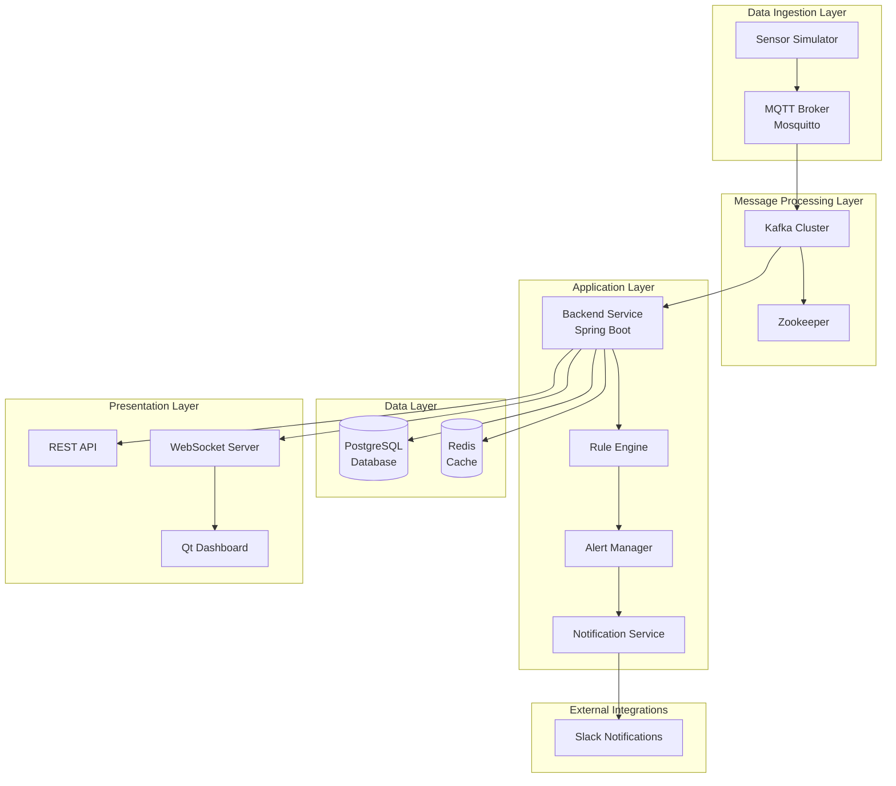

# System Architecture Documentation

## Overview

The Industrial Machine Monitoring & Alert System is a distributed, event-driven IoT platform designed for real-time monitoring of industrial machinery. The system processes sensor telemetry, evaluates configurable alert rules, and provides real-time visualization through multiple interfaces.

## Architecture Principles

### Event-Driven Architecture
- **Asynchronous Processing**: Components communicate through events and messages
- **Loose Coupling**: Services are independent and can be scaled separately
- **Resilience**: System continues operating even if individual components fail
- **Scalability**: Easy to add new machines, sensors, or processing nodes

### Microservices Pattern
- **Single Responsibility**: Each service has a focused purpose
- **Independent Deployment**: Services can be updated independently
- **Technology Diversity**: Different services can use optimal technologies
- **Fault Isolation**: Failures are contained within service boundaries

### CQRS (Command Query Responsibility Segregation)
- **Write Path**: MQTT → Kafka → Database (optimized for writes)
- **Read Path**: Cache → Database → API (optimized for reads)
- **Separation of Concerns**: Different models for reading and writing data

## High-Level Architecture



## Component Architecture

### 1. Data Ingestion Layer

#### Sensor Simulator (Python)
**Purpose**: Generate realistic sensor data for testing and development

**Key Features**:
- Simulates 10 industrial machines (M-001 to M-010)
- Generates 4 sensor types: temperature, vibration, RPM, pressure
- Publishes data every 500ms via MQTT
- Injects anomalies every 30 seconds for testing alert system

**Technology Stack**:
- Python 3.9+
- Paho MQTT Client
- JSON serialization
- Configurable via environment variables

**Data Flow**:
```
[Machine Simulator] → [Sensor Data Generator] → [MQTT Publisher] → [MQTT Broker]
```

#### MQTT Broker (Mosquitto)
**Purpose**: Lightweight message broker for IoT device communication

**Key Features**:
- MQTT 5.0 protocol support
- QoS levels for message delivery guarantees
- Topic-based publish/subscribe messaging
- Persistent message storage
- Authentication and authorization support

**Configuration**:
- Port: 1883 (standard MQTT)
- Topic: `machines/readings`
- QoS: 1 (at least once delivery)
- Persistence: Enabled for reliability

### 2. Message Processing Layer

#### Apache Kafka
**Purpose**: Distributed streaming platform for high-throughput message processing

**Key Features**:
- Horizontal scalability
- Message persistence with configurable retention
- Partitioned topics for parallel processing
- Consumer groups for load balancing
- Exactly-once semantics

**Configuration**:
- Topic: `sensor-readings`
- Partitions: 10 (one per machine for ordering)
- Replication Factor: 1 (development), 3 (production)
- Retention: 7 days
- Compression: Snappy

**Message Flow**:
```
[MQTT Subscriber] → [Kafka Producer] → [Kafka Topic] → [Kafka Consumer] → [Processing Pipeline]
```

#### Zookeeper
**Purpose**: Coordination service for Kafka cluster management

**Responsibilities**:
- Kafka broker coordination
- Topic and partition metadata
- Consumer group coordination
- Leader election for partitions

### 3. Application Layer

#### Backend Service (Spring Boot)
**Purpose**: Core business logic and API services

**Key Components**:

##### MQTT Subscriber Service
```java
@Service
public class MqttSubscriberService {
    // Subscribes to MQTT topic
    // Parses JSON sensor readings
    // Publishes to Kafka for processing
    // Handles connection failures with retry logic
}
```

##### Kafka Consumer Service
```java
@Service
public class KafkaConsumerService {
    // Consumes sensor readings from Kafka
    // Orchestrates processing pipeline
    // Ensures ordered processing per machine
}
```

##### Processing Pipeline
```
[Sensor Reading] → [Validation] → [Persistence] → [Caching] → [Rule Evaluation] → [Alert Processing] → [Broadcasting]
```

**Technology Stack**:
- Java 8 with functional programming features
- Spring Boot 2.7.x for rapid development
- Spring Data JPA for database access
- Spring Kafka for message processing
- Spring WebSocket for real-time communication

#### Rule Engine
**Purpose**: Evaluate sensor readings against configurable alert rules

**Architecture**:
```java
// Functional interface for rule evaluation
@FunctionalInterface
public interface AlertRuleInterface {
    boolean evaluate(SensorReading reading);
}

// Dynamic rule compilation
public class RuleLoader {
    // Loads rules from database
    // Compiles to lambda expressions using SpEL
    // Caches compiled rules in memory
}
```

**Rule Evaluation Process**:
1. Load enabled rules from database at startup
2. Compile rule conditions to lambda expressions
3. Evaluate all rules against each sensor reading
4. Return list of violated rules
5. Performance target: < 50ms per reading

**Supported Rule Syntax**:
```
temperature >= 90 AND temperature < 95
vibration >= 5.0
rpm < 2000 OR rpm > 3500
(temperature >= 95 OR vibration >= 5.0) AND pressure < 15.0
```

#### Alert Manager
**Purpose**: Manage alert lifecycle from creation to resolution

**Key Features**:
- Prevents duplicate alerts for same machine/rule combination
- Automatically resolves alerts when readings normalize
- Triggers notifications for critical alerts
- Maintains alert history and audit trail

**Alert State Machine**:
```
[Rule Violation] → [OPEN Alert] → [Normal Reading] → [RESOLVED Alert]
                      ↓
                [CRITICAL Severity] → [Slack Notification]
```

#### Notification Service
**Purpose**: Send external notifications for critical alerts

**Implementation**:
```java
@Service
public class SlackNotificationService {
    public void sendNotification(Alert alert) {
        CompletableFuture.runAsync(() -> {
            // Build Slack webhook payload
            // Send HTTP POST to Slack webhook
            // Handle failures gracefully
        }).orTimeout(5, TimeUnit.SECONDS);
    }
}
```

**Features**:
- Asynchronous execution to prevent blocking
- Timeout protection (5 seconds)
- Failure resilience with logging
- Rich message formatting with alert details

### 4. Data Layer

#### PostgreSQL Database
**Purpose**: Persistent storage for all system data

**Schema Design**:
```sql
-- Machines table
CREATE TABLE machines (
    id VARCHAR(10) PRIMARY KEY,
    name VARCHAR(100) NOT NULL,
    status VARCHAR(20) NOT NULL,
    location VARCHAR(200),
    installation_date DATE
);

-- Sensor readings with time-series optimization
CREATE TABLE sensor_readings (
    id BIGSERIAL PRIMARY KEY,
    machine_id VARCHAR(10) NOT NULL REFERENCES machines(id),
    temperature DOUBLE PRECISION NOT NULL,
    vibration DOUBLE PRECISION NOT NULL,
    rpm INTEGER NOT NULL,
    pressure DOUBLE PRECISION NOT NULL,
    timestamp TIMESTAMP NOT NULL,
    created_at TIMESTAMP NOT NULL DEFAULT CURRENT_TIMESTAMP
);

-- Indexes for performance
CREATE INDEX idx_machine_id ON sensor_readings(machine_id);
CREATE INDEX idx_timestamp ON sensor_readings(timestamp);
CREATE INDEX idx_machine_timestamp ON sensor_readings(machine_id, timestamp DESC);
```

**Performance Optimizations**:
- Partitioning by date for large sensor_readings table
- Composite indexes for common query patterns
- Connection pooling with HikariCP
- Read replicas for query load distribution

#### Redis Cache
**Purpose**: High-performance cache for frequently accessed data

**Caching Strategy**:
```java
@Service
public class CacheService {
    // Cache latest sensor readings
    // Key pattern: "machine:{machineId}:latest"
    // TTL: 60 seconds
    // Fallback to database on cache miss
}
```

**Cache Patterns**:
- **Cache-Aside**: Application manages cache population
- **Write-Through**: Updates cache when writing to database
- **TTL-Based Expiration**: Automatic cleanup of stale data

### 5. Presentation Layer

#### REST API
**Purpose**: HTTP-based interface for external systems and UIs

**API Design Principles**:
- RESTful resource-based URLs
- JSON request/response format
- HTTP status codes for error handling
- Pagination for large result sets
- Filtering and sorting capabilities

**Key Endpoints**:
```
GET    /api/machines              # List all machines
GET    /api/machines/{id}         # Get machine details
GET    /api/machines/{id}/readings # Get sensor readings
GET    /api/alerts                # List alerts with filters
PUT    /api/alerts/{id}/resolve   # Resolve alert
GET    /api/dashboard/summary     # Dashboard statistics
```

#### WebSocket Server
**Purpose**: Real-time bidirectional communication

**Implementation**:
```java
@Configuration
@EnableWebSocketMessageBroker
public class WebSocketConfig implements WebSocketMessageBrokerConfigurer {
    // Configure STOMP over WebSocket
    // Enable message broker for pub/sub
    // Set up topics for different message types
}
```

**Message Topics**:
- `/topic/readings` - Real-time sensor readings
- `/topic/alerts` - Alert notifications
- `/topic/system` - System status updates

**Client Connection Flow**:
```
[Client] → [WebSocket Handshake] → [STOMP Connect] → [Topic Subscription] → [Message Delivery]
```

#### Qt Dashboard (Future)
**Purpose**: Native desktop application for real-time monitoring

**Planned Features**:
- Machine status overview with color coding
- Real-time charts with 60-second rolling window
- Alert table with filtering and sorting
- Detail panels with gauge visualizations
- WebSocket client with auto-reconnection

## Data Flow Architecture

### Write Path (Sensor Data Ingestion)
```
[Simulator] → [MQTT] → [Backend MQTT Subscriber] → [Kafka Producer] → [Kafka Topic]
    ↓
[Kafka Consumer] → [Validation] → [Database Write] → [Cache Update] → [Rule Evaluation]
    ↓
[Alert Creation] → [Notification] → [WebSocket Broadcast]
```

**Performance Characteristics**:
- End-to-end latency: < 200ms (p95)
- Throughput: 20 messages/second (current), 1000+ messages/second (designed capacity)
- Durability: Messages persisted in Kafka and database
- Ordering: Guaranteed per machine via Kafka partitioning

### Read Path (API Queries)
```
[API Request] → [Cache Check] → [Database Query] → [Response Formatting] → [HTTP Response]
                     ↓
              [Cache Miss] → [Database] → [Cache Population]
```

**Performance Characteristics**:
- Cache hit latency: < 10ms
- Database query latency: < 100ms
- API response time: < 500ms (p95)
- Cache hit ratio: > 80% for latest readings

### Real-Time Path (Live Updates)
```
[Sensor Reading] → [Processing Pipeline] → [WebSocket Broadcast] → [Connected Clients]
[Alert Creation] → [Alert Processing] → [WebSocket Broadcast] → [Dashboard Updates]
```

**Performance Characteristics**:
- WebSocket delivery: < 100ms
- Connection capacity: 1000+ concurrent connections
- Message ordering: Preserved per topic
- Reconnection: Automatic with exponential backoff

## Security Architecture

### Current Security Model
- **Network Security**: Internal Docker network isolation
- **Data Validation**: Input validation and sanitization
- **Error Handling**: Secure error messages without sensitive data
- **Logging**: Audit trail for all operations

### Planned Security Enhancements
```java
// JWT-based authentication
@Configuration
@EnableWebSecurity
public class SecurityConfig extends WebSecurityConfigurerAdapter {
    // Configure JWT authentication
    // Set up role-based access control
    // Enable HTTPS enforcement
}
```

**Security Layers**:
1. **Network Layer**: TLS/SSL encryption, firewall rules
2. **Application Layer**: Authentication, authorization, input validation
3. **Data Layer**: Database encryption, access controls
4. **Infrastructure Layer**: Container security, secrets management

## Scalability Architecture

### Horizontal Scaling Strategies

#### Backend Service Scaling
```yaml
# Docker Compose scaling
services:
  backend:
    deploy:
      replicas: 5
      update_config:
        parallelism: 2
        delay: 10s
```

**Load Balancing**:
- Nginx reverse proxy with round-robin
- Health check-based routing
- Session affinity for WebSocket connections

#### Database Scaling
```
[Write Requests] → [Primary Database]
                        ↓
                   [Replication]
                        ↓
[Read Requests] → [Read Replica 1, Read Replica 2, ...]
```

**Strategies**:
- Read replicas for query load distribution
- Connection pooling and connection multiplexing
- Query optimization and indexing
- Partitioning for large tables

#### Message Processing Scaling
```
[Kafka Topic] → [Partition 0] → [Consumer Instance 1]
              → [Partition 1] → [Consumer Instance 2]
              → [Partition 2] → [Consumer Instance 3]
```

**Kafka Scaling**:
- Increase partition count for higher parallelism
- Add more consumer instances to consumer group
- Scale Kafka brokers for higher throughput
- Optimize batch size and compression

### Vertical Scaling Strategies

#### JVM Optimization
```bash
# Production JVM settings
JAVA_OPTS="-Xmx4g -Xms2g -XX:+UseG1GC -XX:MaxGCPauseMillis=200 -XX:+UseStringDeduplication"
```

#### Database Tuning
```sql
-- PostgreSQL optimization
ALTER SYSTEM SET shared_buffers = '2GB';
ALTER SYSTEM SET effective_cache_size = '8GB';
ALTER SYSTEM SET work_mem = '256MB';
ALTER SYSTEM SET maintenance_work_mem = '512MB';
```

## Monitoring and Observability

### Application Metrics
```java
// Custom metrics with Micrometer
@Component
public class MetricsCollector {
    private final Counter sensorReadingsCounter;
    private final Timer ruleEvaluationTimer;
    private final Gauge activeAlertsGauge;
    
    // Collect business metrics
    // Export to Prometheus/Grafana
}
```

**Key Metrics**:
- **Throughput**: Messages processed per second
- **Latency**: End-to-end processing time
- **Error Rate**: Failed operations percentage
- **Resource Usage**: CPU, memory, disk, network

### Health Checks
```java
@Component
public class CustomHealthIndicator implements HealthIndicator {
    @Override
    public Health health() {
        // Check database connectivity
        // Verify Kafka consumer lag
        // Test Redis cache access
        // Validate MQTT connection
        return Health.up().build();
    }
}
```

### Distributed Tracing
```java
// OpenTracing integration
@RestController
public class MachineController {
    @Traced(operationName = "get-machine-readings")
    public ResponseEntity<List<SensorReading>> getReadings(@PathVariable String machineId) {
        // Trace request across services
        // Correlate logs with trace IDs
    }
}
```

## Deployment Architecture

### Container Architecture
```
┌─────────────────────────────────────────┐
│              Docker Host                │
│  ┌─────────────┐  ┌─────────────────┐   │
│  │   Backend   │  │   PostgreSQL    │   │
│  │ (Spring Boot)│  │   (Database)    │   │
│  └─────────────┘  └─────────────────┘   │
│  ┌─────────────┐  ┌─────────────────┐   │
│  │    Kafka    │  │     Redis       │   │
│  │ (Streaming) │  │    (Cache)      │   │
│  └─────────────┘  └─────────────────┘   │
│  ┌─────────────┐  ┌─────────────────┐   │
│  │  Mosquitto  │  │   Simulator     │   │
│  │   (MQTT)    │  │   (Python)      │   │
│  └─────────────┘  └─────────────────┘   │
└─────────────────────────────────────────┘
```

### Network Architecture
```
[Internet] → [Load Balancer] → [Backend Instances]
                                      ↓
[Internal Network] → [Database, Cache, Message Brokers]
                                      ↓
[Monitoring Network] → [Prometheus, Grafana, ELK]
```

### Multi-Environment Strategy
```
Development → [Feature Branch] → [Dev Environment]
                    ↓
Staging    → [Main Branch]    → [Staging Environment]
                    ↓
Production → [Release Tag]    → [Production Environment]
```

## Technology Decision Matrix

| Component | Technology | Alternatives Considered | Decision Rationale |
|-----------|------------|------------------------|-------------------|
| Backend | Spring Boot + Java 8 | Node.js, Go, Python | Mature ecosystem, team expertise, enterprise features |
| Database | PostgreSQL | MySQL, MongoDB, TimescaleDB | ACID compliance, JSON support, performance |
| Cache | Redis | Memcached, Hazelcast | Rich data types, TTL support, persistence options |
| Message Broker | Kafka | RabbitMQ, AWS Kinesis | High throughput, ordering guarantees, stream processing |
| MQTT Broker | Mosquitto | HiveMQ, EMQX | Lightweight, open source, proven reliability |
| Dashboard | Qt C++ | Electron, Web, JavaFX | Native performance, cross-platform, team expertise |
| Containerization | Docker | Podman, LXC | Industry standard, ecosystem, tooling |

## Future Architecture Evolution

### Phase 1: Current State ✅
- Basic event-driven architecture
- Single-node deployment
- Manual scaling
- Basic monitoring

### Phase 2: Enhanced Scalability 🚧
- Multi-instance backend deployment
- Database read replicas
- Advanced caching strategies
- Comprehensive monitoring

### Phase 3: Cloud-Native 📋
- Kubernetes orchestration
- Service mesh (Istio)
- Auto-scaling policies
- Cloud-managed services

### Phase 4: Advanced Analytics 🔮
- Machine learning integration
- Predictive maintenance
- Advanced anomaly detection
- Real-time analytics dashboard

## Architecture Quality Attributes

### Performance
- **Throughput**: 1000+ messages/second
- **Latency**: < 200ms end-to-end
- **Response Time**: < 500ms API responses
- **Concurrent Users**: 100+ dashboard users

### Reliability
- **Availability**: 99.9% uptime target
- **Fault Tolerance**: Graceful degradation
- **Data Durability**: No data loss guarantees
- **Recovery Time**: < 5 minutes RTO

### Scalability
- **Horizontal**: Add more instances
- **Vertical**: Increase resource allocation
- **Data Growth**: Handle 10x data volume
- **User Growth**: Support 10x concurrent users

### Security
- **Authentication**: JWT-based auth
- **Authorization**: Role-based access control
- **Encryption**: TLS in transit, encryption at rest
- **Audit**: Comprehensive audit logging

### Maintainability
- **Modularity**: Loosely coupled services
- **Testability**: Comprehensive test coverage
- **Observability**: Rich metrics and logging
- **Documentation**: Up-to-date architecture docs

---

This architecture documentation provides a comprehensive view of the Industrial Machine Monitoring System's design, implementation, and evolution strategy. It serves as a reference for developers, operators, and stakeholders to understand the system's structure and make informed decisions about its future development.